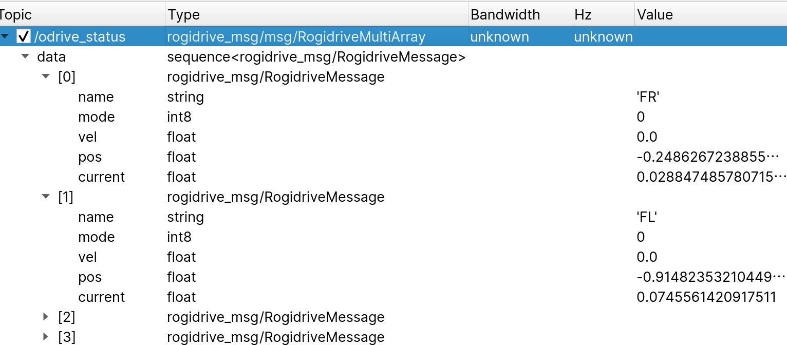

# RogiDrive - ROS Package for ODrive over USB
ODrive, RogiDrive(仮)をUSB経由で駆動するパッケージ．
開発中なので信用しないこと

## Requirements
```bash
pip install odrive
```

## Installation
```
cd ~/ros2_ws/src
git clone git@github.com:KeioRoboticsAssociation/rogidrive.git
cd ../
colcon build
```

## 使い方
#### 指令
jsonファイルを以下の形式で記述する．
```json
{
    "motors":{
        "モータの名前(任意)":{
            "serial": "odriveのシリアル番号",
            "axis": 軸番号
        },
    }
}
```
他のノードから`/odrive_cmd`を`RogidriveMessage`型でpubする．
```RogidriveMessage
string name
int8 mode //0で速度制御，1で位置制御
float32 vel //速度制御のときは速度，位置制御のときは速度上限
float32 pos
float32 current //電流制御のための予約．未実装
```
jsonファイルのパスを指定して起動する．

```bash
ros2 run rogidrive rogidrive --ros-args -p config_path:='jsonファイルのパス'
```

テスト用にrogidrive_testerがある．起動するとモード及びパラメタを入力してpubする．

#### ステータス
本ノードは`/odrive_status`という名前で`RogidriveMultiArray`型のメッセージを10 Hzでpubし続けている．  
`RogidriveMultiArray`は`RogidriveMessage`の配列であり，以下に示す構造となっている．


`RogidriveMessage`の各変数の意味は以下のようになる．
```RogidriveMessage
string name
int8 mode //常に0
float32 vel //速度値 回転/s
float32 pos //位置 回転
float32 current //電流 A
```
中身には`/odrive_status.data[i]`の形でアクセスする必要がある点に注意．